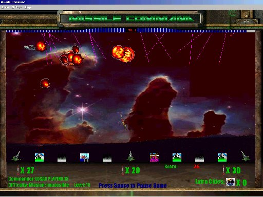

<div align="center">

## Missile Command \(5megs\)  \*links UPDATED\*


</div>

### Description

UPDATED!!!!!!!!

----

Please VOTE AND COMMENT, i'd like to imporve it

remake of the original arcade game. there are a lot more colours. sound, music, and very smooth animation. Warning WIN2k has problems with this program. THIS PROJECT IS FULLY COMMENTTED, therefore it can also be a tutorial, almost every line is commented

game features:

21 levels

powerups / bonuses

1024x768 res, 16 bit colour

can use mouse and / or keyboard

lots of fighters and bombers
 
### More Info
 


<span>             |<span>
---                |---
**Submitted On**   |
**By**             |[Xiaohua Guo](https://github.com/Planet-Source-Code/PSCIndex/blob/master/ByAuthor/xiaohua-guo.md)
**Level**          |Intermediate
**User Rating**    |5.0 (10 globes from 2 users)
**Compatibility**  |VB 5\.0, VB 6\.0
**Category**       |[Games](https://github.com/Planet-Source-Code/PSCIndex/blob/master/ByCategory/games__1-38.md)
**World**          |[Visual Basic](https://github.com/Planet-Source-Code/PSCIndex/blob/master/ByWorld/visual-basic.md)
**Archive File**   |[](https://github.com/Planet-Source-Code/xiaohua-guo-missile-command-5megs-links-updated__1-27078/archive/master.zip)


### Source Code

```
i can't upload my game because it's 5 megs and
this server won't let me, so i uploaded it on
geocities and homestead. dont' worry, there are
no viruses or anything.
download the main gamefile Missile.zip and
anigifocx.zip(needed if you dont' already have
it) from the link
http://defiantxg.homestead.com/files/Missile.zip
(OPEN IN BROWSER FIRST!!!)
http://defiantxg.homestead.com/files/anigifocx.zip
(OPEN IN BROWSER FIRST!!!)
MIRROR:
http://www.geocities.com/defiant_xg/missile.zip
http://www.geocities.com/defiant_xg/anigifocx.zip
extract missile.zip, then extract anigifocx.zip into missile.zip folder and you are set
*********
all the music stuff is here if you want it, it's
optional, the game will function perfectly without it(they are separate wav files, use getright or other download managers to "grab" all links all at once) place these wav files in missile/music dir:
http://www.geocities.com/defiant_xg/
http://www.geocities.com/defiant_xg1/
http://www.geocities.com/defiant_xg2/
http://www.geocities.com/defiant_xg3/
GEOCITES may go down once in a while, just wait a few hours :)
if the bandwidth was exceeded for this month, please let me know
************************************
mouse cursor must be manually set back to your
original because i can't find a way to detect the
original cursor dir, if you know how to detect
the normal mouse pointer dir location, please
email me at xiaohuaguo@hotmail.com and i will
give you credit on my program
this is the only side effect and it's pretty minor
this only happened once or twice: bonus cities
are not calculated right and are invisible on
screen... i can't find out why... help is
appreciated
p.s reports say WIN2k makes this game very
slow... please comment
***************************
if the link doesn't work, i will fix it very soon
read readme file from command.zip (main file) if
you need extra info contact me at
xiaohuaguo@hotmail.com
try to ignore the story... i just made something up
```

